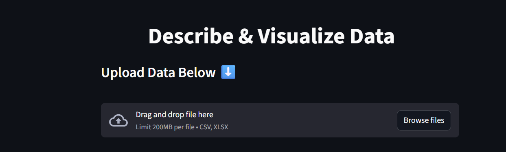
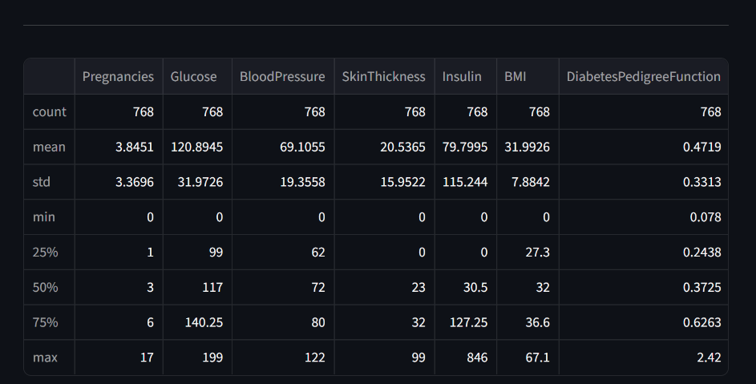
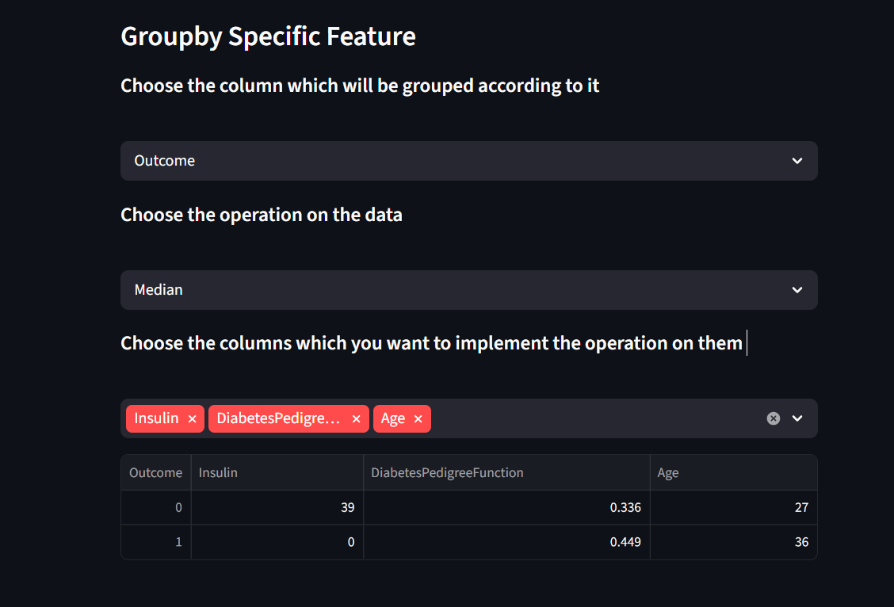
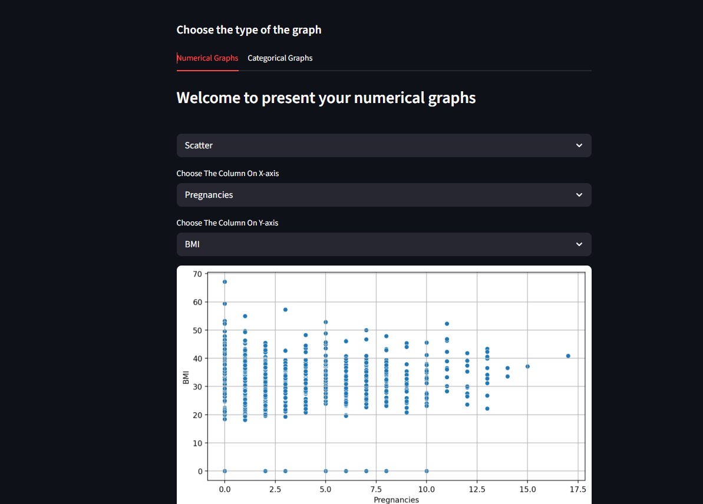
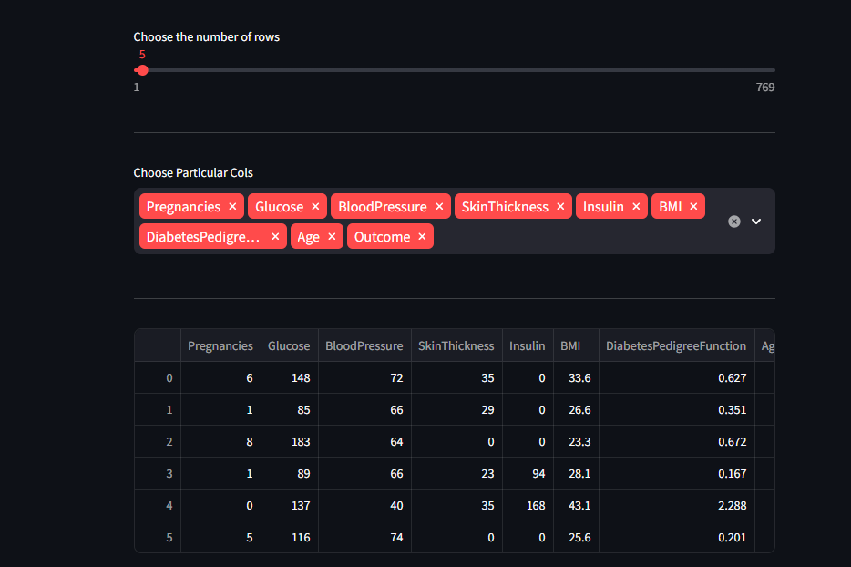
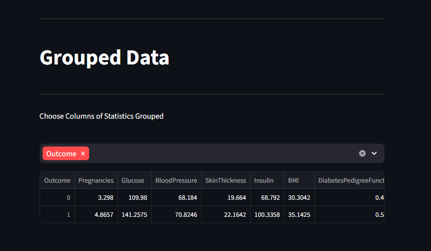
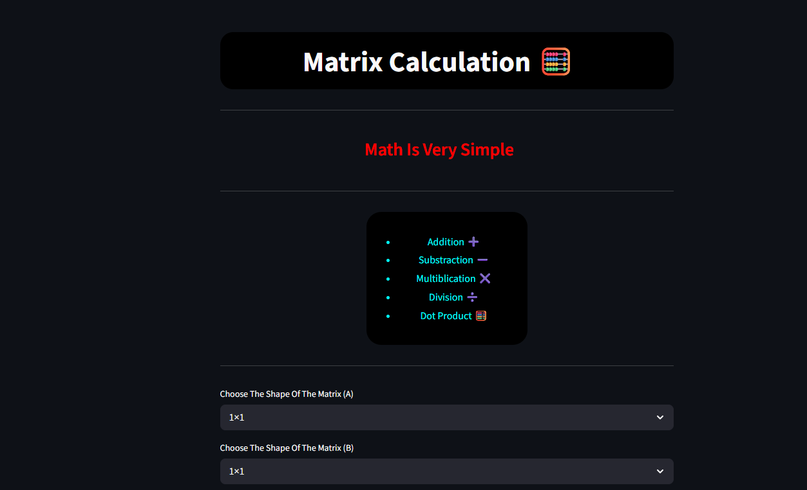
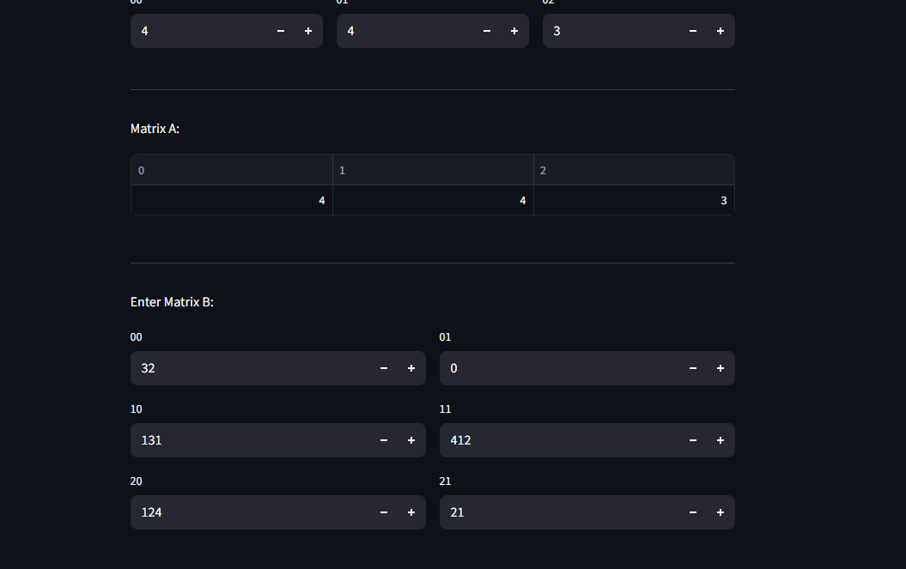
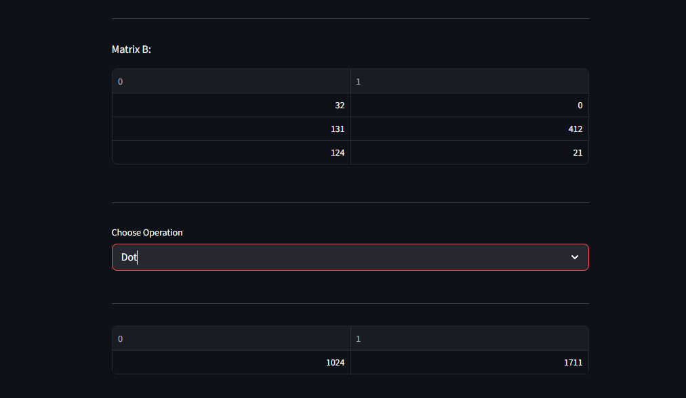

# Data Analyst Project

## It consist of 3 Main parts

## There is data for Diabetes  from kaggle in the repo you can use it to test the website

- First Part is about Data visualization and Some information you will get from Your data

first page (upload_csv_file):

general data about the uploaded data

devide the data into or according to specific feature

here you can do your graphs on any feature you want

- Second Part is Presenting your data and some small features

here you can take an overview on yourdata 

here you can present the mean of other values according to features in the columns

- Third Part is the multplying of the matrix

here you can determine the shape of the matrix and do any operations on them 

